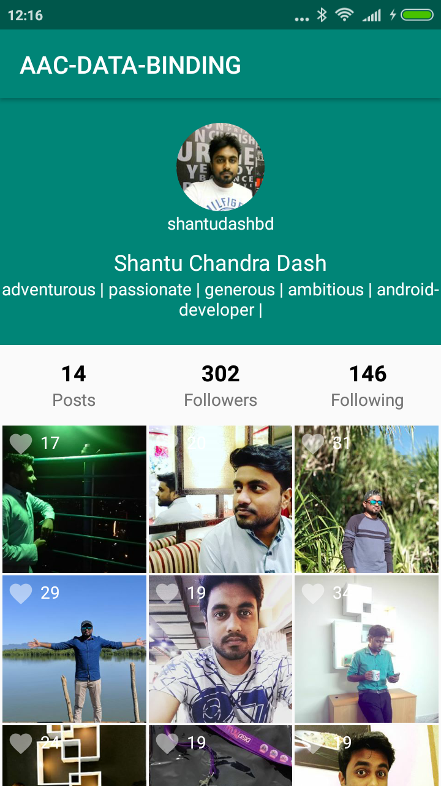

# AndroidArchitectureComponentsDataBindingJava
This repository contains Android Architecture Components ( Data Binding, Live Data, View Model )

## About This Project
In this project we will build an instagram profile using android architecture components
<B>( LiveData and ViewModel and Data Binding )</B> usning <B>MVVM</B> pattern by the help of
[Retrofit](https://square.github.io/retrofit/) for consuming rest api data from [Instagram Api](https://www.instagram.com/developer/)

## Setting Up

Step-1 : Download this project on your local machine.

Step-2 : Get an access token from [Instagram Api](https://www.instagram.com/developer/)

        How to get an access token from instagram api
        
         1 : Register Your Application
         2 : Authentication

         https://api.instagram.com/oauth/authorize/?client_id=CLIENT-ID&redirect_uri=REDIRECT-URI&response_type=token
         For authentication use this url. It has three arguments

             First, client_id : you will get a client_id when you will register your application
             Second, redirect_uri : redirect_uri will be your redirect_uri when you register your application. It has to be same. I used 
             Third, response_type : response_type will be token

         3 : Once you has been authenticated and then authorized your application, Instagram redirects them to your redirect_uri with the access_token in the url fragment.
         It will look like this: http://your-redirect-uri#access_token=YOUR-ACCESS-TOKEN

Step-3 : Put your access token inside Constants file under this project

Step-4: Run the application.

## App Features
* Show Instagram profile (Posts, Followers, Following and Bio)

## App Demo

## Library Used
* [Android Architecture Components](https://developer.android.com/topic/libraries/architecture/)
* [Live Data](https://developer.android.com/topic/libraries/architecture/livedata)
* [View Model](https://developer.android.com/topic/libraries/architecture/viewmodel)
* [Data Binding](https://developer.android.com/topic/libraries/data-binding/)
* [Retrofit](https://square.github.io/retrofit/)
* [Instagram Api](https://www.instagram.com/developer/)
* [Glide](https://github.com/bumptech/glide)
* [Recyclerview](https://developer.android.com/guide/topics/ui/layout/recyclerview)

## Contributing

Anyone can contribute in this project.

## Authors

**Shantu Chandra Dash** 
* [GitHub](https://github.com/shantudas)
* [Facebook](https://www.facebook.com/shantudashbd)
* [Linkedin](https://www.linkedin.com/in/shantudashbd/)
* [Instagram](https://www.instagram.com/shantudashbd/)

## License

This project is licensed under the MIT License - see the [LICENSE.md](https://github.com/shantudas/AndroidArchitectureComponentsDataBindingJava/blob/master/LICENSE) file for details
